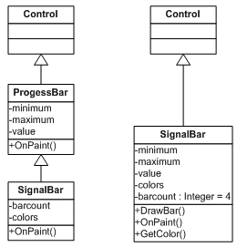
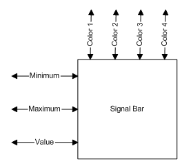
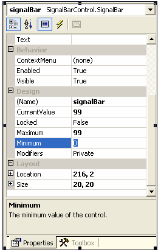
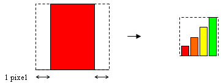

# SignalBar Control with Designer Support for .NET Compact Framework

_<https://github.com/timdetering/SignalBar>_


## Introduction

There is a saying "Necessity is the mother of invention". I am not inventing something new here but I have the spirit of invention with me when writing this article. The necessity to create a custom signal bar for developing a Pocket PC application inspired me to write such a control.

## Background

Unfortunately, writing custom control in .NET CF is not as straightforward as in the full .NET Framework. There is no "Designer Support" (DS) provided! Fortunately, there are articles to help you add the DS to .NET CF. One of them is written by Jim Wilson: _Adding Designer Support to the .NET Compact Framework DateTimePicker Control_. Therefore, I strongly suggest you read his article as the pre-requisite to understanding my article. In this article, therefore, I will concentrate more on writing the actual control itself. However, the source code will come complete with the DS and ready for use.

I guess the heart of writing custom controls is the ability to connect the logic behind the control with the graphics. To write a control, many programmers know how to code the functional logic part. However, few know how to deal with the graphics/UI part. Thus, I will concentrate more on the drawing bit and leave the detailed discussion of the functional part to the reader to check the source code.

## Using the control

You can download the `signalbar_demo.zip` file. There are two assemblies, the run time and design time. Extract the run time assembly (`SignalBarControl.dll`) to _\Program Files\Microsoft Visual Studio .NET 2003\CompactFrameworkSDK\v1.0.5000\Windows CE\_ and create a subfolder Designer if it doesn’t exist and copy over the design time assembly (`SignalBarControl.Design.dll`). Next, add it to your VS.NET ToolBox (_View->Toolbox_ or Ctrl+Alt+X). You may want to create your own control tab by right-clicking and selecting Add Tab. Then add the control assembly by selecting Add/Remove Items… menu item to the newly created tab. Then browse and find the `SignalBarControl.Design.dll` assembly from the `{Installation Directory}\Designer\` folder, click OK, then you should be able to see and drag-&-drop the `SignalBar` control to your form.

## The requirements

Let’s start with the requirements. We are supposed to write a colorful signal bar that indicates a qualitative value using a graphical representation. The colors can be customized in design time. Further, we will have a fixed four bars with different length to indicate signal strength. You can generalize the design further by allowing the user to specify the number of bars; however I refrain from doing so in this article for the sake of simplicity. If your PDA is running the latest Windows CE, you may find a similar control sitting on the top bar.

You can see that the control behaves similar to the progress bar control. You initialize the `Minimum` and `Maximum` value, set the current `Value` and the control will display the graphical bar representation based on the three variables you just set. However, in regards to the graphical representation, this signal bar is more specialized than the progress bar control.

Therefore, from a conceptual design perspective, you may derive the `SignalBar` class from the progress bar control but do the painting yourself. However, in this article I’d rather derive `SignalBar` from the `Control` class. First, this way I can show you the design from scratch including defining its fields, properties and methods. Secondly, since we are writing a control for .NET CF, we will try to avoid unnecessary overhead caused by doing inheritance relationship.



### Figure 1: SignalBar class diagram, inheritance vs. non inheritance version

## The Design

My favorite way of designing a control is by drawing it like a ‘black-box’ with inputs-outputs coming in and out. In my case, this always works well so that I have a clean and clear idea of designing such a control.

We have specified before that the `SignalBar` will have the `Minimum`, `Maximum`, and (current) `Value` as well as individual color for each of the four bars. As a result of correct initialization you should get a nice picture of the signal bar.



### Figure 2: Signal Bar 'black-box'

As with built-in controls, you can edit its properties from the Visual Studio .NET (VS.NET) Property window. By default all public properties appear in the Property window. However, for .NET CF, a little more work needs to be done before a property can appear in the Property window. Please consult Wilson’s article for more explanation.

Let’s take an example. To expose the Minimum property to the VS.NET Property window, we could do the following:

``` csharp
    protected int minimum;
    #if NETCFDESIGNTIME
    [System.ComponentModel.Browsable(true)]
    [System.ComponentModel.Category("Design")]
    [System.ComponentModel.DefaultValue(0)]
    [System.ComponentModel.Description("The minimum value of the control.")]
    #endif
    public int Minimum
    {
        get
        {
            return minimum;
        }
        set
        {
            minimum = value;
            Invalidate();
        }
    }
```

### Figure 3: Exposing Minimum property to VS.NET Property window

The last line in the set section, `Invalidate()`, calls the drawing routine to repaint the control when the user change the minimum value. You should see the Minimum property ‘browsable’ in the VS.NET Property window under ‘Design’ category with the specified description underneath and defaulted to ‘0’ as shown in the figure below:



### Figure 4: Minimum property in VSNET Property window

You can then replicate the same process to other properties.

Next, I will explain the graphical bar construction. First, we need to create a function to draw an individual bar taking a bar index and color as the parameters, `DrawBar(int index, Color color)`. The challenging part of creating the DrawBar function is in calculating the size of the rectangle dynamically.



### Figure 5: Bar design

The width of each bar is calculated as the width of the control divided by four. However, by exactly dividing the space into four, the control will look too stuffy. With a simple mathematical trick, we can chop 1 pixel off from each bar’s left and right rectangles so that we can see a little space between the bars.

Determining each bar’s height is a little tricky. This is because the coordinate system used specifies the origin at the top left rather than at the bottom left of the screen. Therefore, when you specify y = 0 and the height = h, the graphics doesn’t look quite right. It looks inversed. Say the control’s height is H and the calculated bar’s height is h, to fix this you need to inverse the vertical coordinate by Inverse(y) = H – h.

## The code

Now, as we are clear with the requirements and specifications, we are set to write the code. The DrawBar function starts with determining the bar’s width and height. The bar’s height is calculated as the fraction of the control’s height, i.e. bar’s index + 1 multiplied by the control's height divide by barcount. Remember we have agreed that the number of bars is fixed to 4 although you can generalize it further. If you intend to do so, the only bit that you need to modify is how you can specify the colors for n bars.

``` csharp
    protected void DrawBar(int index, Color color)
    {
        int barWidth = this.Width / barcount;

        int height = Convert.ToInt16(Height * (index + 1)/ barcount);
        Rectangle r = new Rectangle(
        (index * barWidth) + 1, Height-height,
        barWidth-1, height);

        SolidBrush br = new SolidBrush(color);

        m_graphics.FillRectangle(br, r);
    }
```

The next function is responsible for handling the `OnPaint` event. When the control receives the `OnPaint` event this function is executed. We can force the control to receive the `OnPaint` event by calling `Invalidate()`. You may want to check in the MSDN library the differences between `Invalidate()`, `Refresh()`, and `Update()`. In our case, I am using `Invalidate()` call to repaint the control.

To avoid flickering, we create an off-screen bitmap, `m_bmp`, by calling `CreateMemoryBitmap()`. Then we draw the bars. The current value of the control, currentValue, along with the minimum and maximum values determine how many bars will get drawn. Then, a corresponding number of bars will get drawn by calling the `DrawBar` function. The function completes its cycle with blitting the memory bitmap to the screen.

``` csharp
    protected override void OnPaint(PaintEventArgs e) 
    {
        // draw to memory bitmap
        CreateMemoryBitmap();

        // init background
        m_graphics.Clear(this.BackColor);

        // determine how many bars should be drawn
        int nBar = (currentValue-minimum) * barcount / (maximum-minimum) ;

        // draw bars
        for(int i=0; i <  nBar; i++)
        {
            DrawBar(i, GetColor(i));
        }

        // blit memory bitmap to screen
        e.Graphics.DrawImage(m_bmp, 0, 0);
    }

    /// <summary>
    /// Create offscreen bitmap. This bitmap is used for double-buffering
    /// to prevent flashing.
    /// </summary>
    private void CreateMemoryBitmap()
    {
        if (m_bmp == null || m_bmp.Width != this.Width
                          || m_bmp.Height != this.Height)
        {
            // memory bitmap
            m_bmp = new Bitmap(this.Width, this.Height);
            m_graphics = Graphics.FromImage(m_bmp);
        }
    }
```

When the control is resized we want to update the graphics, therefore, we override the `OnResize()` handler so that when the control’s size changes, it will generate the `OnPaint` message by calling the `Invalidate()` function again and repainting the control with the updated size.

``` csharp
    protected override void OnResize(EventArgs e)
    {
        base.OnResize (e);
        this.Invalidate();
    }
```

## The conclusion

The absence of Designer Support in .NET CF could not stop us to innovate. Thanks to people who have written good articles on adding Designer Support to .NET CF. This allows me to write a customized control that can be easily added into my project by drag-and-drop. I heard though .NET CF 2.0 will save us from this trouble.

<https://www.codeproject.com/Articles/10921/SignalBar-Control-with-Designer-Support>